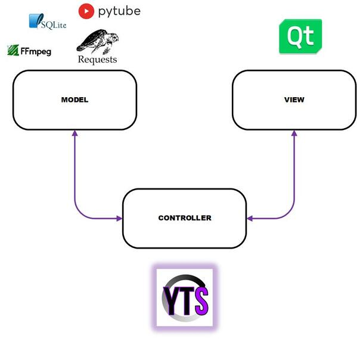
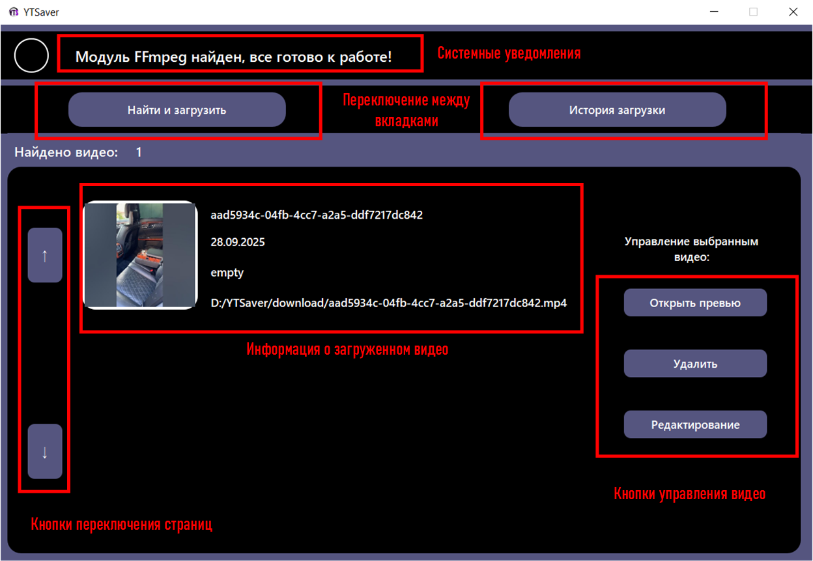

<div align="center">
    
</div>


# "YTSaver"
<a name="section-1"></a>

YTSaver - это десктоп-приложение, которое позволяет пользователям легко найти и загрузить видео с платформы 
YouTube, в зависимости от их предпочтений по качеству, расширению видео-файла и другим параметрам, без назойливой 
рекламы, утерянных cookies и перенаправлений на сторонние сервисы!

### Основные возможности:

- Удобный и интуитивно понятный графический интерфейс;
- Хранение истории загруженных видео (имя, описание, дата загрузки, путь расположения к видео-файлу, 
иконка);
- Редактирования информации о загруженных видео;
- Удаление загруженных видео из истории и устройства;
- Просмотр превью загруженного видео;
- Поиск и загрузка видео из YouTube с выбором параметров загрузки;


# Описание проекта


Целью разработки данного проекта являлось реализация standalone windows-based приложения на Python, позволяющего любым
пользователям получать ресурсы с платформы YouTube прямо на их устройства. 


### Архитектура проекта:

"YTSaver" основан на архитектурном паттерне MVC (Model-View-Controller). За счет этого достигается возможность 
заменимости компонентов приложения, без потребностей полного перестроения проекта при внедрении новых изменений в
модель, контроллер или же графическую часть приложения. 

Конкретно в данной реализации модель никак не взаимосвязана с 
представлением, а контроллер берет на себя все обязанности по их взаимодействиям.

<div style="text-align:center; margin-top:40px; margin-bottom:40px;" align="center">
    
</div>


- View: решает задачи по отображению данных приложения. Представление полностью основано на фреймворке PyQT5. 
Все элементы UI представляют собой QT виджеты, с описанными к ним StyleSheets (по аналогии с CSS), сигналами и 
слотами. Благодаря EventLoop, происходит отслеживание поведения виджетов, а также пользовательское взаимодействие с ними 
(signals). Все обработчики событий (slots) логически вынесены в контроллер.


- Model: содержит всю логику приложения, включая обработку данных, взаимодействие с базой данных и сторонними ресурсами.
Для работы с YouTube используются библиотеки pytube_fix и requests. pytube_fix обеспечивает доступ к основным данным 
видео (именование, thumbnail превью) и всем потокам. Было решено отказаться от DASH-потоков, поэтому загрузка аудио и 
видео потоков разделена. Для их объединения используется утилита FFmpeg, совместно с библиотекой ffmpeg-python,
обеспечивая высокую скорость слияния аудио и видео. Все данные о загруженных видеофайлах хранятся в базе данных.
Для хранения данных выбрана sqlite3 из-за легковесности и эффективности, соответствуя политике приложения по сохранению
информации.


- Controller: обеспечивает взаимодействие между моделью и представлением, а также выполняет функции по обработке ошибок 
приложения, запуску необходимых компонентов, потоков и осведомлению пользователя о текущих задачах. Здесь осуществлены 
обработчики событий модели, представления, реализация точек входа и выхода приложения.


### Инструменты разработки:


- Редактор кода: PyCharm Community Edition 2025.
- Редактор скриптов для сборки установщика: Inno Setup Compiler 6.5.3.
- СУБД: DB Browser for SQLite Version 3.13.1
- Версия Python: 3.11
- Версия пакетного менеджера pip: 25.2 
- Версия winget: 1.11.430

###### Разработка велась на машине со следующими характеристиками:

- Версия ОС: Windows 10 Pro 22H2
- Тип системы: 64-разрядная операционная система, процессор x64

### Разработанные модули:

Приложение состоит из 10 программных компонентов.


1. YTSaver.py - основной исполняющий модуль. В нем описано создание экземпляров 
MVC компонентов программы и получение сведений о текущей рабочей директории;

2. model.py - модель, в данном файле описана бизнес-логика, все параметры приложения, вызовы 
вспомогательных модулей и запуски скриптов.

3. view.py - представление, в данном файле описана создание всех QT элементов, установка их стилей, 
привязка сигналов к слотам контроллера и простые графические эффекты.

4. controller.py - контроллер, в данном файле описаны все обработчики событий от модели и контроллера, 
а также их взаимодействия.

5. video_operations.py - вспомогательный модуль для модели. В нем описаны операции по заполнению, редактированию, 
удалению данных о видео.

6. db_operations.py - вспомогательный модуль для модели. В нем описаны операции с базой данных по созданию таблиц, вставке,
удалению, чтению записей.

7. files_operations.py - вспомогательный модуль для модели. В нем описаны операции с файловой системой (получение полных путей, 
проверка имен, их генерация и пр.) а также взаимодействие с FFmpeg.

8. pytube_operations.py - вспомогательный модуль для модели. В нем описаны операции по получению сведений про видеопотоки 
с платформы YouTube и их загрузка.
9. player.py - вспомогательный модуль для представления. В не описаны операции по извлечению кадров из видео и их
контролируемому воспроизведению.
10. app_exceptions.py - вспомогательный модуль для представления. В не описаны операции по извлечению кадров из видео и их
контролируемому воспроизведению.

Также, для установки и проверки наличия утилиты FFmpeg на устройстве, разработаны следующие .bat файлы:

- FFmpegChecker.bat - скрипт для проверки наличия FFmpeg;

- FFmpegInstaller.bat - скрипт для установки FFmpeg при помощи winget;

- FFmpegUninstaller.bat - скрипт для деинсталляции FFmpeg;

# Сборка проекта

Для сборки проекта используется инструмент pyinstaller.

#### Первый шаг:

Клонируйте репозиторий к себе на устройство.
```bash
   git clone https://github.com/mathews3s/YTSaver.git
```


#### Второй шаг:

Запустить команду упаковки YTSaver.py в исполняемый файл со следующими опциями

```bash
pyinstaller --noconfirm --onefile --windowed --icon "path_to_dir\app\appData\appIcons\YTS.ico" "path_to_dir\YTSaver.py"`
```
Данная команда позволяет собрать проект в один исполняемый файл (--onefile), скрыть консольное окно при запуске приложения
(--windowed) и указать путь к иконке приложения (--icon).

После выполнения этой команды вы получите готовый исполняемый файл вашего проекта.
#### Третий шаг:

Переместите исполняемый файл в директорию, в которой хотите собрать проект. В ней же
создайте папки app/appData/appIcons и app/appData/utility и скопируйте в них содержимое аналогичных папок в
склонированном репозитории. При запуске YTSaver.exe остальные системные папки будут созданы автоматически.

# Установка и использование "YTSaver"

#### Целевая аудитория:

Приложение рассчитано на уверенных пользователей ПК, требуются базовые знания по работе с ОС Windows и PowerShell,
опыт использования платформы YouTube. Ограничений по возрастным группам не имеется. Приложение рассчитанно на 
русскоговорящую аудиторию, однако для комфортного использования требуется базовый уровень владения английским.

#### Системные требования:

* ОС: Windows (10 с версии 1709 и выше, 11);
* Свободное место на дисковом пространстве: 186 Мб;
* Наличие стабильного интернет-соединения;

#### Установка:

Перед установкой, проверьте соответствие характеристик вашего устройства системным требованиям.

1. Загрузите файл установщика с папки [install](install/) `yts_setup.exe`. 
2. По завершению загрузки, запустите исполняемый файл и следуйте инструкциям SetupWizard. 
3. По завершению установки, в указанной вами целевой папке будет находиться исполняемый файл 
приложения `YTSaver.exe`, запустите его. 
4. Если у вас на устройстве отсутствует FFmpeg, в появившемся консольном окне вам будет предложено установить его. 
(Если вы не доверяете установщику, можете выполнить загрузку самостоятельно)
5. Если FFmpeg был загружен установщиком, вам будет предложено перезапустить ваше устройство. Выполните перезагрузку ОС.
6. Запустите приложение и пройдите проверку наличия FFmpeg (автоматически).
7. Приложение "YTSaver" готово к использованию!

####  Использование:

В самой верхней части окна приложения, расположена секция системных уведомлений.
Пожалуйста, чаще обращайте внимание сюда. Если вы что-то делаете не так или возникли ошибки,
приложение уведомит вас.

###### "Найти и загрузить": 

В данной вкладке предоставляются инструменты для поиска и загрузки
видео с YouTube. Вы можете выбрать разрешение, расширение выходного файла, кадры в секунду (именно в данном порядке), а
также путь для сохранения видео;

###### "История загрузки": 

В данной вкладке вам отображены ваши последние загруженные видео. При
их количестве свыше двух, вы без труда сможете перелистать их при помощи кнопок вверх и вниз.
Для управления видео нужно его выбрать (кликните по иконке необходимого видео). При нажатии
на кнопку При выборе видео разблокируются кнопки управления видео. При просмотре превью аудио
не воспроизводится, данная функция носит ознакомительный характер.

Важно!! Удаление видео производится и из истории загрузок и из памяти устройства! 

При редактировании информации о загруженном видео, вы сможете поменять его иконку, имя
файла (имя будет проверено на валидность), короткое описание, а также путь расположения видеофайла.

Иконки используются исключительно в списке загруженных видео и к самому видеофайлу не применяются!


<div style="text-align:center; margin-top:40px; margin-bottom:40px;" align="center">
    
</div>

# Прочая информация

#### Вклад в проект:

"YTSaver" является open-source продуктом. В любой момент вы можете предложить свои изменения 
в основной репозиторий. Пожалуйста, соблюдайте условия [commit rules](docs/commit%20rules.txt) и создавайте отдельную ветку 
для разработки (dev + xxx: номер вашей ветки).

Поддержите проект и меня, поставив звезду на этот репозиторий!

#### Лицензии:

Проект создавался под Generel Purpose License 2.0 (GPL-2.0). 

#### Послесловие:
<a name="section-3"></a>

Если вы просмотрели всю информацию до конца, огромная благодарность за проявленный 
интерес к моей работе!
